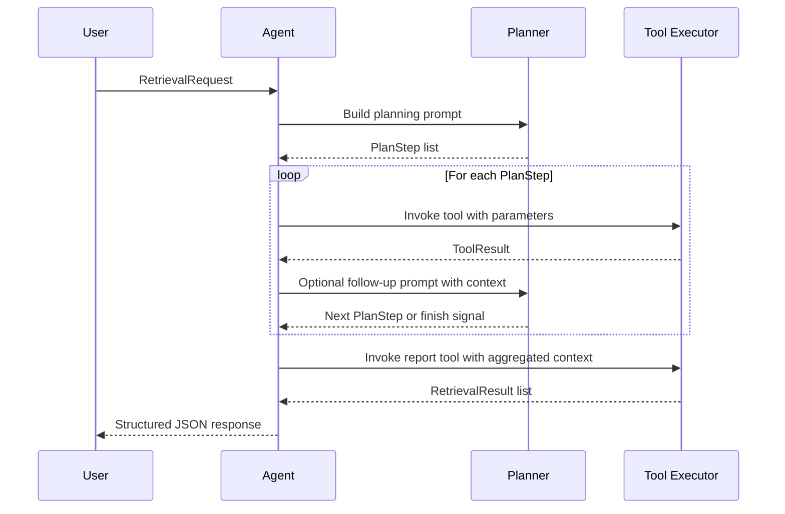

# Code Context Agent

> A stateless retrieval agent that orchestrates LLM reasoning with deterministic tooling to surface relevant code context across multi-language repositories.

- [📘 中文版说明](README.zh.md)
- [Workflow Flowchart](docs/context_agent_flowchart.md)
- [Project Structure](docs/project_structure.md)

## Overview

Code Context Agent offers a reusable blueprint for building a "planner + tools" retrieval workflow. A planner (backed by OpenAI or a heuristic fallback) examines the user's intent and dynamically selects from a catalogue of deterministic tools—directory exploration, symbol metadata, file extraction, ripgrep search, and result submission—to gather evidence about code symbols, values, or call sites. The agent is stateless, making it trivial to embed in CLI utilities, long-running services, or Model Context Protocol (MCP) servers.

## Architecture

### End-to-end flow
```mermaid
flowchart TD
    A[User Request\n(workspace, file, lines, symbol, intent, query)] --> B[Planner]
    B -->|Selects next action| C{Tool Registry}
    C --> D[Directory Tree]
    C --> E[Symbol Index]
    C --> F[File Reader]
    C --> G[Ripgrep Search]
    D & E & F & G --> H[Pipeline Accumulates Findings]
    H -->|Sufficient context| I[Report Tool]
    I --> J[Structured Retrieval Result]
    J --> K[Response to User]
```

### Planner-driven execution


## Project Layout

```
context_agent/
├── app.py                 # Factory to assemble configuration, tools, and pipeline
├── cli.py                 # Typer-based CLI entry point
├── config.py              # AgentConfig and ToolConfig definitions
├── integrations/
│   └── mcp.py             # MCP server adapter and stdio launcher
├── models.py              # Pydantic models for requests, intents, plans, and results
├── pipeline.py            # Planner-driven execution loop
├── planner.py             # OpenAI-backed planner with heuristic fallback
└── tools/
    ├── base.py            # Shared tool contracts and error types
    ├── directory_tree.py  # Workspace tree enumeration
    ├── file_reader.py     # File slicing utilities
    ├── report.py          # Result submission tool
    ├── ripgrep.py         # Keyword search via ripgrep
    └── symbol_index.py    # Placeholder for AST-derived symbol metadata
```

Additional documentation is available in the [`docs/`](docs) folder.

## Configuration

The planner can source OpenAI parameters from either environment variables or CLI flags. Supported environment variables include:

- `OPENAI_API_KEY`
- `OPENAI_BASE_URL`
- `OPENAI_MODEL`
- `OPENAI_ORGANIZATION`
- `OPENAI_TIMEOUT` (optional override in seconds)

When no credentials are supplied, the planner gracefully falls back to a heuristic plan that still exercises the deterministic tools.

## Usage

### Install dependencies

```bash
pip install -e .[dev]
```

### Run from the CLI

```bash
context-agent run \
  /path/to/workspace \
  src/module.py \
  10 40 \
  --symbol TargetClass \
  --intent symbol_definition \
  --query "Locate the definition of TargetClass" \
  --openai-api-key "$OPENAI_API_KEY" \
  --openai-model gpt-4.1-mini
```

The CLI resolves paths relative to the workspace, executes the retrieval pipeline, and prints a JSON-formatted summary of tool calls and aggregated results. Any OpenAI parameters omitted on the command line will fall back to environment variables.

### Embed in Python code

```python
from pathlib import Path

from context_agent import create_app
from context_agent.models import RetrievalIntent, RetrievalRequest

agent = create_app()
request = RetrievalRequest(
    workspace_path=Path("/path/to/project"),
    file_path=Path("src/main.py"),
    start_line=10,
    end_line=30,
    symbol="main",
    intent=RetrievalIntent.SYMBOL_IMPLEMENTATION,
    natural_language_query="Find the implementation of main",
)
results = list(agent.run(request))
```

### Run as an MCP tool

1. Install the optional dependencies:
   ```bash
   pip install -e .[mcp]
   ```
2. Launch the stdio server:
   ```bash
   python -m context_agent.integrations.mcp
   ```
3. Register the exposed `retrieve_code_context` tool with your MCP host. The JSON schema matches the CLI arguments and supports the same OpenAI configuration options.

## Development & Testing

- Format / lint with your preferred tools (e.g., `ruff`, `black`).
- Compile-time sanity check:
  ```bash
  python -m compileall src
  ```
- Extend the tool implementations or planner logic to integrate with production-grade services.

## License

This project is licensed under the MIT License. See [LICENSE](LICENSE) for details.
