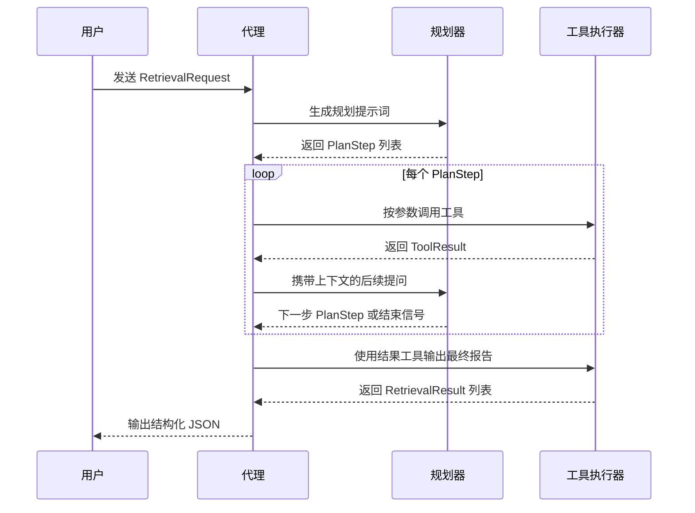

# Code Context Agent 简介

> 一个无状态的检索代理，通过 LLM 规划与确定性工具协同工作，为多语言代码仓库找出最相关的上下文信息。

- [English Documentation](README.md)
- [流程图](docs/context_agent_flowchart.md)
- [工程结构说明](docs/project_structure.md)

## 核心概念

Code Context Agent 采用「规划器 + 工具」架构。规划器（可调用 OpenAI，也可回退到内置启发式策略）根据检索意图选择需要执行的工具，包括目录树遍历、符号元数据、文件片段提取、ripgrep 关键词搜索以及结果提交。所有工具都是无状态的，可以在 CLI、本地服务或 Model Context Protocol (MCP) 场景中复用。

## 架构概览

### 端到端流程
```mermaid
flowchart TD
    A[用户请求\n(工程路径、文件、行范围、符号、意图、自然语言描述)] --> B[规划器]
    B -->|选择下一步| C{工具注册表}
    C --> D[目录树工具]
    C --> E[符号索引工具]
    C --> F[文件读取工具]
    C --> G[ripgrep 搜索工具]
    D & E & F & G --> H[管线汇总上下文]
    H -->|收集完成| I[结果提交工具]
    I --> J[结构化检索结果]
    J --> K[返回给用户]
```

### 调度时序


## 工程结构

```
context_agent/
├── app.py                 # 创建代理实例的工厂函数
├── cli.py                 # 基于 Typer 的命令行入口
├── config.py              # AgentConfig 与 ToolConfig 配置模型
├── integrations/
│   └── mcp.py             # MCP 服务器适配器与 stdio 启动器
├── models.py              # 请求、意图、计划与结果的 Pydantic 模型
├── pipeline.py            # 驱动规划器与工具执行的管线
├── planner.py             # 支持 OpenAI + 启发式回退的规划器
└── tools/
    ├── base.py            # 工具基类与通用异常
    ├── directory_tree.py  # 枚举工作区目录结构
    ├── file_reader.py     # 按行范围提取文件片段
    ├── report.py          # 汇总并提交检索结果
    ├── ripgrep.py         # 调用 ripgrep 进行关键词搜索
    └── symbol_index.py    # AST/静态分析结果的占位实现
```

## 配置方式

规划器会优先使用环境变量中的 OpenAI 参数，也可以通过 CLI 选项覆盖：

- `OPENAI_API_KEY`
- `OPENAI_BASE_URL`
- `OPENAI_MODEL`
- `OPENAI_ORGANIZATION`
- `OPENAI_TIMEOUT`（可选，单位为秒）

如果未提供凭据，系统会自动回退到内置的启发式规划逻辑，仍可调用确定性工具完成检索。

## 使用方法

### 安装依赖
```bash
pip install -e .[dev]
```

### 命令行体验
```bash
context-agent run \
  /path/to/workspace \
  src/module.py \
  10 40 \
  --symbol TargetClass \
  --intent symbol_definition \
  --query "Locate the definition of TargetClass" \
  --openai-api-key "$OPENAI_API_KEY" \
  --openai-model gpt-4.1-mini
```

命令行工具会自动把相对路径转换为工作区内的绝对路径，执行检索流程，并输出包含工具调用轨迹及检索结果的 JSON。

### Python 代码嵌入
```python
from pathlib import Path

from context_agent import create_app
from context_agent.models import RetrievalIntent, RetrievalRequest

agent = create_app()
request = RetrievalRequest(
    workspace_path=Path("/path/to/project"),
    file_path=Path("src/main.py"),
    start_line=10,
    end_line=30,
    symbol="main",
    intent=RetrievalIntent.SYMBOL_IMPLEMENTATION,
    natural_language_query="定位 main 的实现",
)
results = list(agent.run(request))
```

### 作为 MCP 工具使用
1. 安装可选依赖：
   ```bash
   pip install -e .[mcp]
   ```
2. 启动 stdio 服务器：
   ```bash
   python -m context_agent.integrations.mcp
   ```
3. 在宿主系统中注册 `retrieve_code_context` 工具，参数与 CLI 一致，同样支持上述 OpenAI 配置选项。

## 开发与测试

- 可结合 `ruff`、`black` 等工具进行格式化与静态检查。
- 基础编译检查：
  ```bash
  python -m compileall src
  ```
- 根据需要扩展规划器和工具实现，以对接真实的代码分析或检索服务。

## 许可证

项目基于 MIT 协议发布，详见 [LICENSE](LICENSE)。
