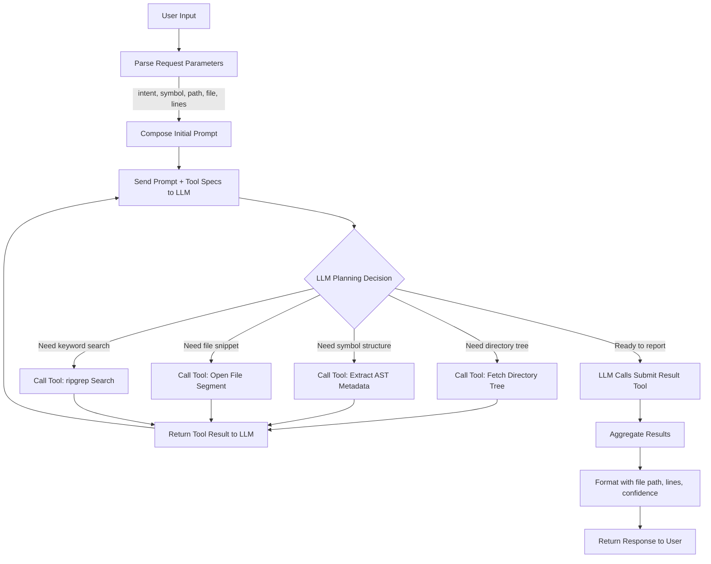

# Code Context Retrieval Agent Flowchart

## Step Descriptions

1. **User Input**: Collects project path, file name, line range, symbol, and intent.
2. **Parse Request Parameters**: Validates and structures the input for prompting.
3. **Compose Initial Prompt**: Builds the initial system/user prompt detailing the task and available tools.
4. **Send Prompt + Tool Specs to LLM**: Calls the OpenAI Chat API with tool definitions and conversation history.
5. **LLM Planning Decision**: The LLM determines whether more context is needed and which tool(s) to invoke.
6. **Tool Calls**: Depending on the plan, invoke tools for directory tree, AST metadata, file content, or ripgrep search.
7. **Return Tool Result to LLM**: Tool outputs are appended to the conversation for the LLM to reason over.
8. **Iterative Loop**: Steps 4–7 repeat until the LLM has gathered sufficient context.
9. **Submit Result Tool**: Once satisfied, the LLM triggers the submission tool with gathered evidence.
10. **Aggregate Results**: Collects retrieved snippets, paths, line ranges, and confidence scoring.
11. **Format Response**: Structures the final payload for the user.
12. **Return Response**: Delivers the final structured result.
